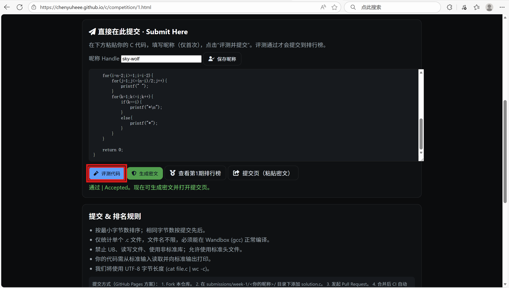
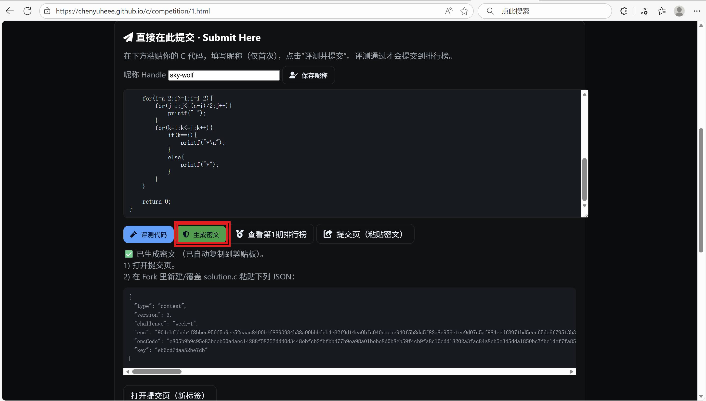
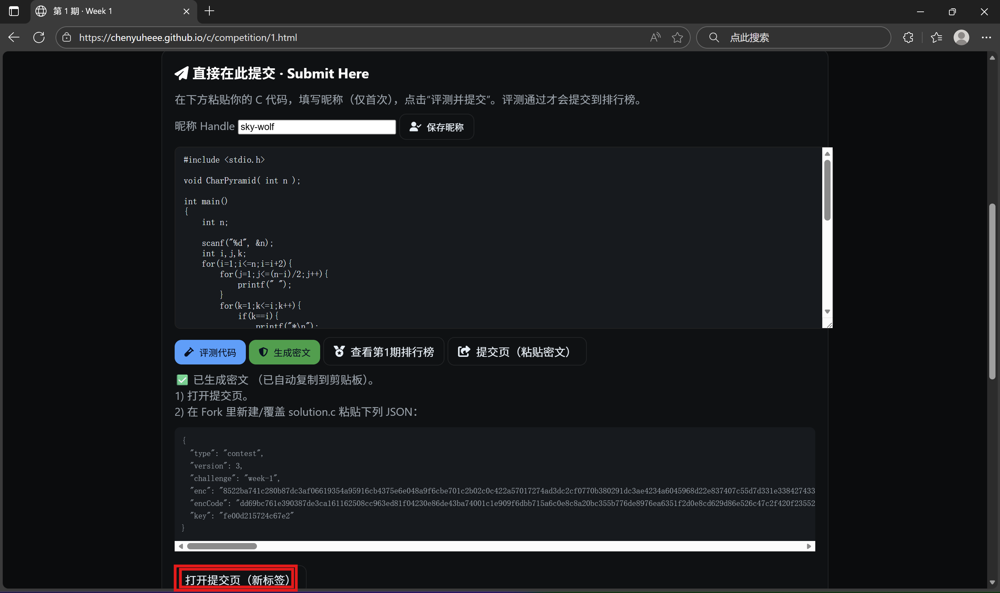
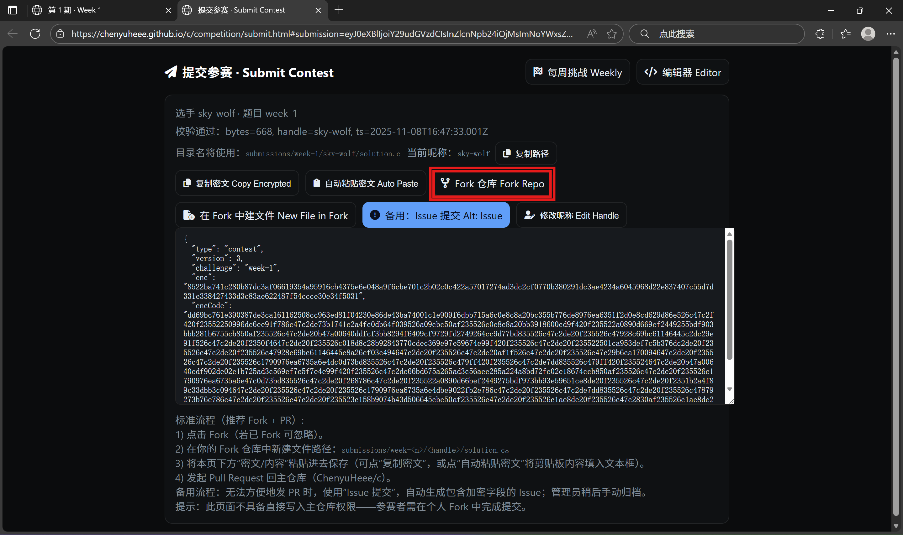
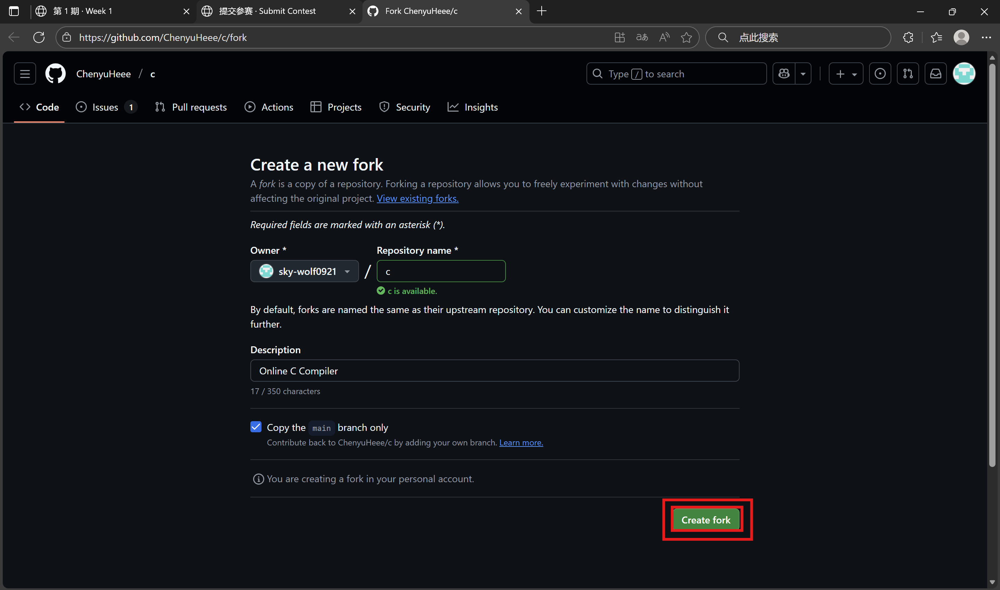
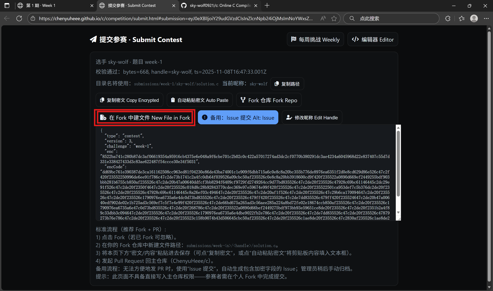
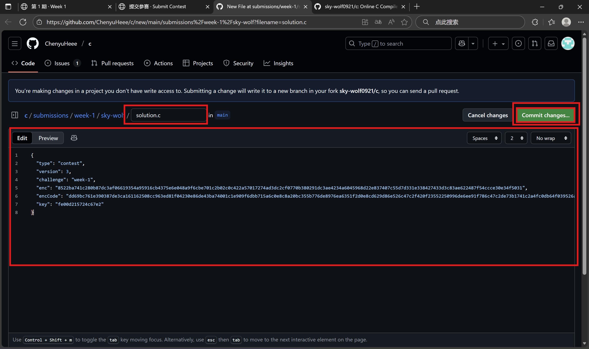
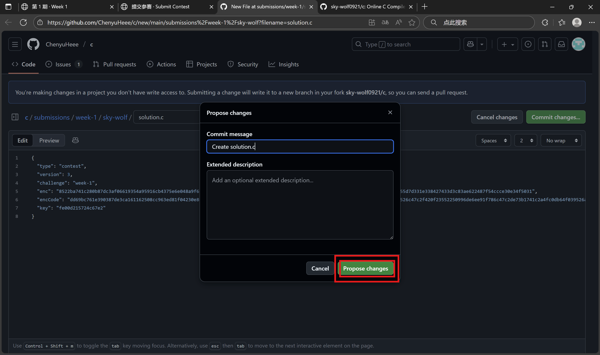
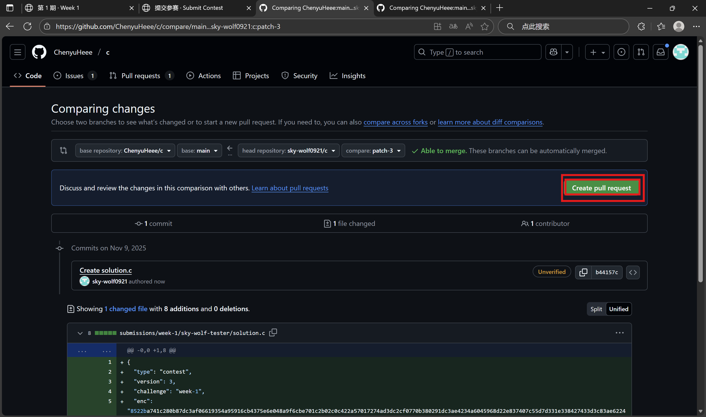
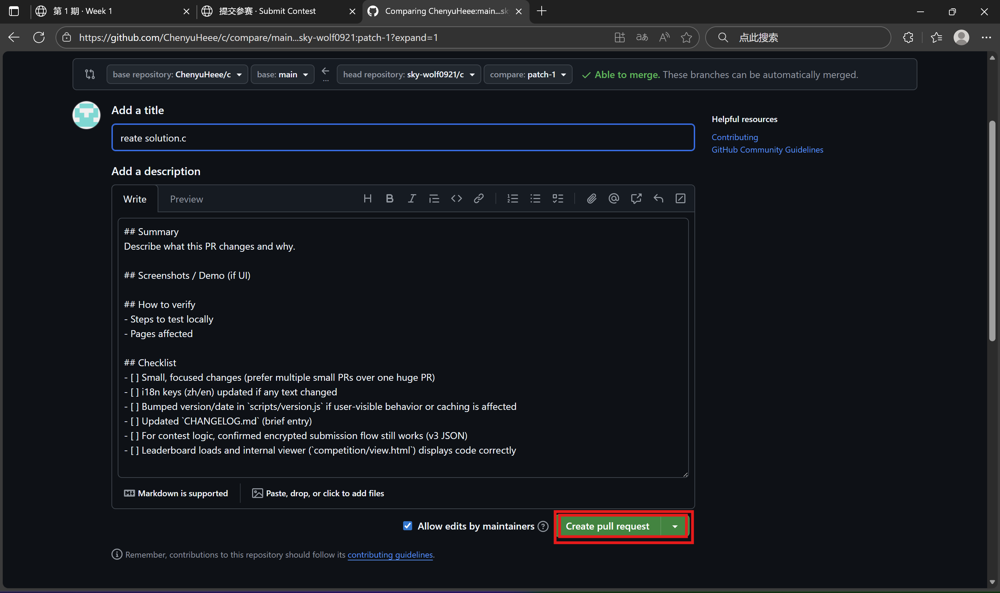

# 提交教程 Submission Guide

第一步：点击 评测代码   

第二步：点击 生成密文   

第三步：点击 打开提交页（新标签）   

第四步：在新标签点击 Fork仓库Fork Repo    

第五步：点击 Create Fork    

第六步：回到提交页面，点击 复制密文  

第七步：点击 在Fork中建文件 New File in Work   

第八步：在新标签内，保证上方红框内的部分路径如图（solution.c），在下方红框内粘贴密文，然后点击 commit changes   

第九步：点击 propose changes    

第十步：点击 Create pull request   

第十一步：下拉页面，找到并点击 Create pull request    
